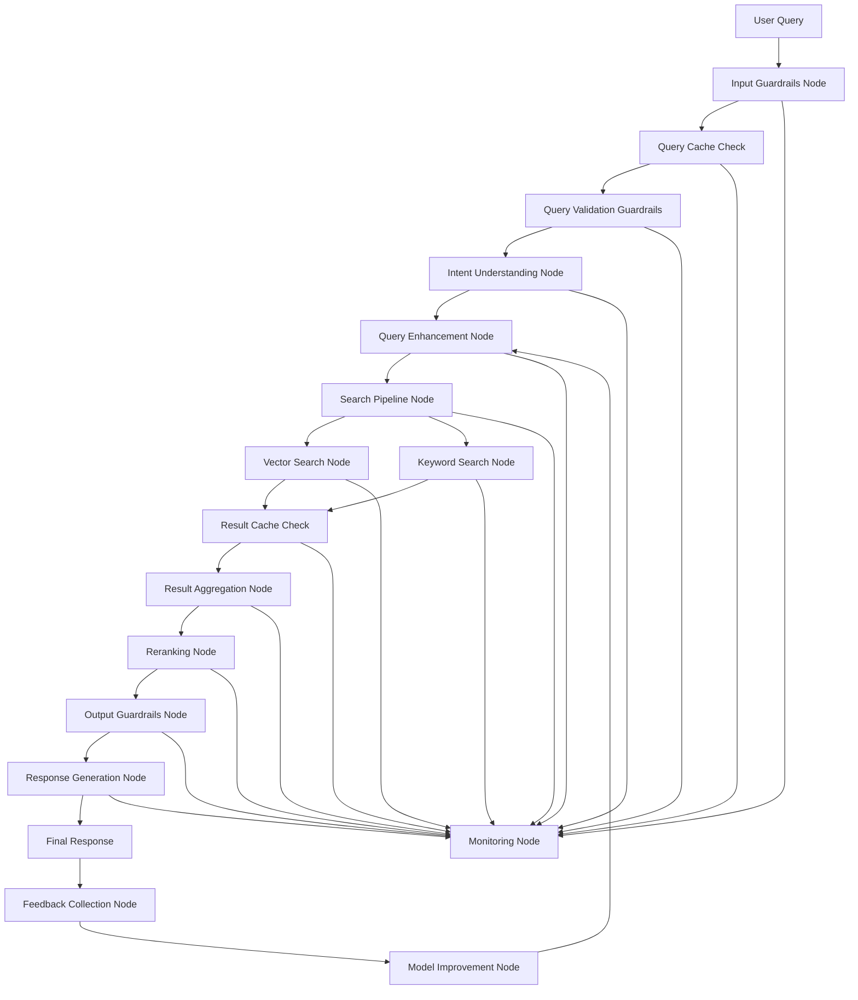

# LangGraph Flow Architecture

## Abstract Flow Diagram



## Node Descriptions

### 1. Input Guardrails Node
- Input: Raw user query
- Output: Validated query
- Responsibilities:
  - Query length validation
  - Character set validation
  - Rate limiting
  - IP-based restrictions
  - Basic syntax checking

### 2. Query Cache Check Node
- Input: Validated query
- Output: Cached result or query
- Responsibilities:
  - Cache lookup
  - Cache key generation
  - Cache invalidation check
  - Cache warming

### 3. Query Validation Guardrails Node
- Input: Query from cache check
- Output: Validated and analyzed query
- Responsibilities:
  - Semantic validation
  - Intent plausibility check
  - Query complexity analysis
  - Resource requirement estimation
  - Context validation
  - Language detection
  - Query intent classification
  - Potential bias detection

### 4. Intent Understanding Node
- Input: Validated and analyzed query
- Output: Classified intent with confidence score
- Responsibilities:
  - Intent detection
  - Query categorization
  - Confidence scoring

### 5. Query Enhancement Node
- Input: Classified intent
- Output: Enhanced query
- Responsibilities:
  - Query parsing
  - Parameter extraction
  - Context enrichment
  - Synonym expansion
  - Query optimization

### 6. Search Pipeline Node
- Input: Enhanced query
- Output: Search strategy
- Responsibilities:
  - Query routing
  - Search strategy selection
  - Initial result gathering

### 7. Vector Search Node
- Input: Search strategy
- Output: Vector search results
- Responsibilities:
  - Embedding generation
  - Similarity search
  - Initial ranking

### 8. Keyword Search Node
- Input: Search strategy
- Output: Keyword search results
- Responsibilities:
  - Keyword extraction
  - Text matching
  - Initial ranking

### 9. Result Cache Check Node
- Input: Search results
- Output: Cached or fresh results
- Responsibilities:
  - Result cache lookup
  - Cache key generation
  - Cache invalidation
  - Result aggregation preparation

### 10. Result Aggregation Node
- Input: Search results
- Output: Combined results
- Responsibilities:
  - Result merging
  - Duplicate removal
  - Initial sorting

### 11. Reranking Node
- Input: Combined results
- Output: Ranked results
- Responsibilities:
  - Relevance scoring
  - Business rules application
  - User preference consideration
  - Diversity balancing

### 12. Output Guardrails Node
- Input: Ranked results
- Output: Validated results
- Responsibilities:
  - Response size validation
  - Content filtering
  - Bias detection
  - Hallucination prevention
  - Privacy checks
  - Response format validation
  - Sensitive information filtering

### 13. Response Generation Node
- Input: Validated results
- Output: Final response
- Responsibilities:
  - Response formatting
  - Context integration
  - User-friendly presentation
  - Explanation generation

### 14. Feedback Collection Node
- Input: User interactions
- Output: Feedback data
- Responsibilities:
  - Usage tracking
  - Success metrics
  - Error logging
  - Performance monitoring

### 15. Model Improvement Node
- Input: Feedback data
- Output: Model updates
- Responsibilities:
  - Performance analysis
  - Model retraining
  - Parameter optimization
  - Feature engineering

### 16. Monitoring Node
- Input: System metrics
- Output: Health status
- Responsibilities:
  - Performance monitoring
  - Error tracking
  - System health checks
  - Resource usage monitoring
  - Alert generation

## State Management

```typescript
interface SearchState {
  query: string;
  intent: {
    type: string;
    confidence: number;
    parameters: Record<string, any>;
  };
  enhancedQuery: string;
  searchResults: Array<SearchResult>;
  rankedResults: Array<RankedResult>;
  finalResponse: string;
  cache: {
    queryHit: boolean;
    resultHit: boolean;
    cacheKey: string;
    timestamp: number;
  };
  guardrails: {
    inputValidation: {
      passed: boolean;
      checks: {
        length: boolean;
        charset: boolean;
        rateLimit: boolean;
        ipCheck: boolean;
        syntax: boolean;
      };
    };
    queryValidation: {
      passed: boolean;
      checks: {
        semantic: boolean;
        intent: boolean;
        complexity: boolean;
        resources: boolean;
        context: boolean;
      };
    };
    outputValidation: {
      passed: boolean;
      checks: {
        content: boolean;
        privacy: boolean;
        format: boolean;
      };
    };
  };
  metadata: {
    timestamp: number;
    processingTime: number;
    error?: Error;
    resourceUsage: {
      memory: number;
      cpu: number;
      network: number;
    };
  };
}
```

## Error Handling Strategy

1. **Node-Level Errors**
   - Each node implements its own error handling
   - Errors are logged and propagated with context
   - Fallback strategies for critical nodes

2. **Graph-Level Errors**
   - Centralized error handling
   - Circuit breaker pattern
   - Graceful degradation

3. **Recovery Mechanisms**
   - Automatic retries for transient errors
   - Fallback to simpler search strategies
   - User-friendly error messages

## Performance Considerations

1. **Parallel Processing**
   - Vector and keyword search run in parallel
   - Result aggregation for comprehensive results
   - Caching at multiple levels

2. **Resource Management**
   - Connection pooling
   - Memory usage optimization
   - Query timeout handling

3. **Scalability**
   - Horizontal scaling of nodes
   - Load balancing
   - Rate limiting

## Integration Points

1. **Existing Codebase**
   - Authentication/Authorization
   - Data access layers
   - Logging systems

2. **External Services**
   - Vector database
   - Monitoring tools
   - Analytics systems

## Next Steps

1. Implement core node interfaces
2. Set up basic graph structure
3. Create test harness
4. Begin with Intent Classification Node
5. Add monitoring and logging 