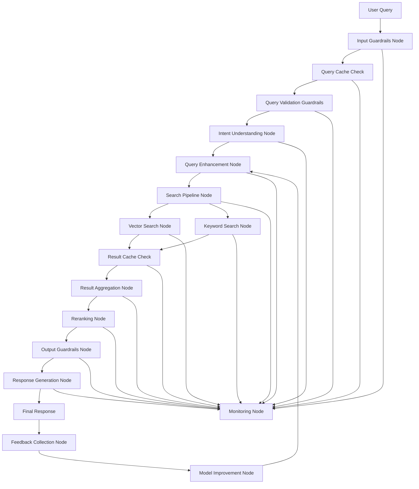

# AI Engineering Hackathon 2025 - Project Plan

## Architecture Overview



## Implementation Phases

### Phase 1 - Basic Graph Structure (Week 1)
- [ ] Set up LangGraph module structure
  - [ ] Create `src/langgraph/` directory
  - [ ] Set up core components
  - [ ] Define node interfaces
  - [ ] Create base types
- [ ] Integration Planning
  - [ ] Map existing components
  - [ ] Define API boundaries
  - [ ] Document integration points
- [ ] Development Environment
  - [ ] Configure build tools
  - [ ] Set up testing framework
  - [ ] Establish coding standards

### Phase 2 - Core Search Functionality (Week 2)
- [ ] Guardrails Implementation
  - [ ] Input Guardrails
    - [ ] Query length limits
    - [ ] Character set validation
    - [ ] Rate limiting
    - [ ] IP-based restrictions
    - [ ] Basic syntax checking
  - [ ] Query Validation Guardrails
    - [ ] Semantic validation
    - [ ] Intent plausibility check
    - [ ] Query complexity analysis
    - [ ] Resource requirement estimation
    - [ ] Context validation
  - [ ] Output Guardrails
    - [ ] Response validation
    - [ ] Content filtering
    - [ ] Privacy checks
- [ ] Caching System
  - [ ] Query cache setup
  - [ ] Result cache setup
  - [ ] Cache invalidation strategy
  - [ ] Cache warming mechanism
- [ ] Vector Search Implementation
  - [ ] Set up vector database
  - [ ] Implement embedding generation
  - [ ] Create similarity search
- [ ] Search Pipeline
  - [ ] Implement basic search node
  - [ ] Create result aggregation
  - [ ] Set up parallel processing
- [ ] Basic API Layer
  - [ ] Define endpoints
  - [ ] Implement request handling
  - [ ] Set up error handling

### Phase 3 - Intent Understanding (Week 3)
- [ ] Intent Classification
  - [ ] Implement intent detection
  - [ ] Create query parsing
  - [ ] Add safety validation
- [ ] Query Enhancement
  - [ ] Add synonym expansion
  - [ ] Implement context enrichment
  - [ ] Create query optimization
- [ ] Safety & Guardrails
  - [ ] Implement content filtering
  - [ ] Add bias detection
  - [ ] Create hallucination prevention
  - [ ] Add query complexity limits
  - [ ] Implement resource usage limits

### Phase 4 - Enhancement & Reranking (Week 4)
- [ ] Reranking Implementation
  - [ ] Add business rules
  - [ ] Implement user preferences
  - [ ] Create relevance optimization
- [ ] Performance Optimization
  - [ ] Implement caching
  - [ ] Add connection pooling
  - [ ] Create load balancing
  - [ ] Add result compression
  - [ ] Implement partial results
- [ ] Monitoring Setup
  - [ ] Add logging
  - [ ] Implement metrics
  - [ ] Create alerts
  - [ ] Add anomaly detection

### Phase 5 - Response & Feedback (Week 5)
- [ ] Response Generation
  - [ ] Implement formatting
  - [ ] Add explanations
  - [ ] Create safety checks
  - [ ] Add response validation
  - [ ] Implement response caching
- [ ] Feedback System
  - [ ] Add usage tracking
  - [ ] Implement metrics collection
  - [ ] Create improvement pipeline
- [ ] Documentation
  - [ ] Write API docs
  - [ ] Create user guides
  - [ ] Document architecture

## Technical Stack

- **Language**: TypeScript
- **Framework**: LangGraph
- **Vector Database**: TBD (Based on performance requirements)
- **LLM Integration**: TBD (Based on model requirements)
- **API Framework**: Existing codebase integration
- **Monitoring**: TBD (Based on existing infrastructure)
- **Testing**: Jest + Supertest

## State Management

```typescript
interface SearchState {
  query: string;
  intent: {
    type: string;
    confidence: number;
    parameters: Record<string, any>;
  };
  enhancedQuery: string;
  searchResults: Array<SearchResult>;
  rankedResults: Array<RankedResult>;
  finalResponse: string;
  cache: {
    queryHit: boolean;
    resultHit: boolean;
    cacheKey: string;
    timestamp: number;
  };
  guardrails: {
    inputValidation: {
      passed: boolean;
      checks: {
        length: boolean;
        charset: boolean;
        rateLimit: boolean;
        ipCheck: boolean;
        syntax: boolean;
      };
    };
    queryValidation: {
      passed: boolean;
      checks: {
        semantic: boolean;
        intent: boolean;
        complexity: boolean;
        resources: boolean;
        context: boolean;
      };
    };
    outputValidation: {
      passed: boolean;
      checks: {
        content: boolean;
        privacy: boolean;
        format: boolean;
      };
    };
  };
  metadata: {
    timestamp: number;
    processingTime: number;
    error?: Error;
    resourceUsage: {
      memory: number;
      cpu: number;
      network: number;
    };
  };
}
```

## Caching Strategy

1. **Query Cache**
   - Cache key: Normalized query + context
   - TTL: 1 hour
   - Invalidation: On data updates
   - Size limit: 10,000 entries

2. **Result Cache**
   - Cache key: Query + filters + pagination
   - TTL: 5 minutes
   - Invalidation: On data updates
   - Size limit: 50,000 entries

3. **Embedding Cache**
   - Cache key: Text content
   - TTL: 24 hours
   - Invalidation: Manual
   - Size limit: 100,000 entries

## Guardrails Implementation

1. **Input Guardrails**
   - Query length limits
   - Character set validation
   - Rate limiting
   - IP-based restrictions
   - Basic syntax checking

2. **Query Validation Guardrails**
   - Semantic validation
   - Intent plausibility check
   - Query complexity analysis
   - Resource requirement estimation
   - Context validation
   - Language detection
   - Query intent classification
   - Potential bias detection

3. **Processing Guardrails**
   - Resource usage limits
   - Timeout handling
   - Error rate monitoring
   - Circuit breakers
   - Fallback mechanisms

4. **Output Guardrails**
   - Response size limits
   - Content filtering
   - Bias detection
   - Hallucination prevention
   - Privacy checks
   - Response format validation
   - Sensitive information filtering

## Key Challenges & Solutions

1. **Scalability & Deployment**
   - Horizontal scaling of nodes
   - Load balancing implementation
   - Resource optimization

2. **Model Optimization**
   - Embedding model fine-tuning
   - Ranking algorithm optimization
   - Query understanding improvement

3. **Guardrails & Safety**
   - Content filtering
   - Bias detection
   - Hallucination prevention

4. **Monitoring & Observability**
   - Comprehensive logging
   - Performance metrics
   - Health checks

5. **Architectural Decisions**
   - Hybrid RAG approach
   - Parallel processing
   - Caching strategy

6. **Cost & Latency Optimization**
   - Query optimization
   - Result caching
   - Resource management

7. **Dataset Engineering**
   - Training data pipeline
   - Feedback collection
   - Continuous improvement

8. **Infrastructure & Security**
   - API security
   - Rate limiting
   - Access controls

9. **Continuous Improvement**
   - Feedback loops
   - Model retraining
   - Performance monitoring

## Progress Tracking

| Phase | Status | Start Date | End Date | Notes |
|-------|--------|------------|----------|-------|
| 1     | Pending | -          | -        | -     |
| 2     | Pending | -          | -        | -     |
| 3     | Pending | -          | -        | -     |
| 4     | Pending | -          | -        | -     |
| 5     | Pending | -          | -        | -     |

## Success Metrics

1. Search latency < 200ms
2. Accuracy > 90%
3. System uptime > 99.9%
4. Successful handling of 1000+ QPS
5. Proper error handling and recovery
6. Cache hit ratio > 60%
7. Guardrail effectiveness > 95%

## Risk Mitigation

1. Regular backups
2. Feature flags for gradual rollout
3. Comprehensive monitoring
4. Clear rollback procedures
5. Regular team syncs
6. Cache warming procedures
7. Guardrail testing and validation

## Next Steps

1. Review and approve updated project plan
2. Set up development environment
3. Begin Phase 1 implementation
4. Schedule regular progress reviews 